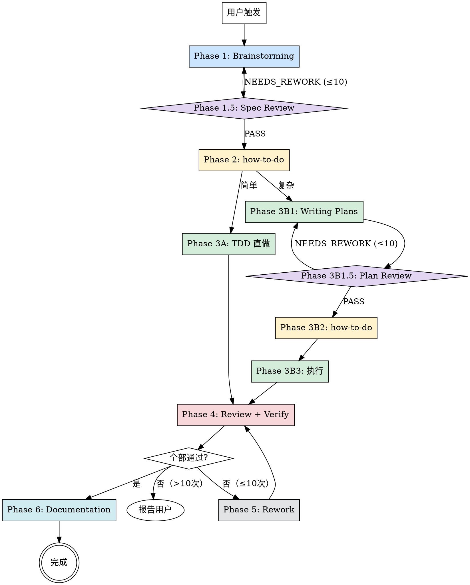

# FullWorkFlow — 全流程编排

一键完成：brainstorming → spec review → 复杂度分析 → 实现 → plan review → 验证 → rework → 文档。全程使用 subagent，主会话仅做编排。

**开始时宣布：** "使用 full-workflow 技能，启动全流程开发。"

## 核心原则

- **全部 subagent** — 每个阶段派 subagent 执行，主会话只做编排和决策路由
- **最小上下文** — subagent 只接收当前阶段的必要信息，不传递历史
- **并行优先** — 无依赖的阶段并行执行
- **60% 红线** — 单个 subagent 预估上下文用量超过可用上下文的 60% → 必须拆分
- **无 git 操作** — 全流程不执行任何 git commit/add/push，最终提交由用户决定
- **渐进式加载** — 所有 skill 文件通过 subagent 按需读取，不加载到主会话

## 完整流程

## 阶段 1: Brainstorming

**目标：** 通过协作对话生成设计 spec

1. 读取 prompt 模板：`brainstorming-prompt.md`
2. 用 `general-purpose` subagent 派发，传入：
   - 用户原始需求
   - 项目根目录路径
   - brainstorming skill 路径：`referenced-skills/brainstorming/SKILL.md`
3. subagent 通过 AskUserQuestion 与用户交互
4. 期望输出：`{ "spec_path": "...", "summary": "..." }`

**注意：** brainstorming subagent 拥有完整交互权，用户与它直接对话。主会话等待它返回结果。

## 阶段 1.5: Spec Review

**目标：** 独立审查 spec 的完整性、一致性和可实施性

1. 读取 prompt 模板：`spec-review-prompt.md`
2. 用 `general-purpose` subagent 派发，传入：
   - spec 文件路径
3. 期望输出：`{ "verdict": "PASS" | "NEEDS_REWORK", "issues": [...], "recommendations": [...] }`

**Re-work 循环（最多 10 次）：**
- `PASS` → 继续阶段 2
- `NEEDS_REWORK` → 将 Reviewer 的 issues 反馈传给新的 Brainstorming subagent（重新派发阶段 1），产出修改后的 spec 后再次进入 Spec Review
- 超过 10 次 → escalate 给用户

## 阶段 2: how-to-do（复杂度判断）

**目标：** 分析 spec，预估上下文消耗，选择执行策略

1. 读取 prompt 模板：`how-to-do-prompt.md`
2. 用 `general-purpose` subagent 派发，传入：
   - spec 文件路径
   - 分析阶段标记：`spec`
3. 期望输出：`{ "complexity": "simple" | "complex", "next_skill": "tdd" | "writing-plans", "reason": "..." }`

### 60% 红线规则

- **< 40% 可用上下文** → 简单，TDD 直做
- **40%-60%** → 边界情况，保守选 writing-plans
- **> 60%** → 必须拆分，选 writing-plans

## 阶段 3A: TDD 直通实现（简单路径）

1. 读取 prompt 模板：`tdd-direct-prompt.md`
2. 用 `general-purpose` subagent 派发，传入：
   - spec 路径
   - 项目根目录
3. 期望输出：`{ "status": "done" | "blocked", "files_changed": [...], "blocker_reason": "..." }`

## 阶段 3B1: Writing Plans（复杂路径）

1. 读取 prompt 模板：`writing-plans-prompt.md`
2. 用 `general-purpose` subagent 派发，传入：
   - spec 路径
   - 项目根目录
3. 期望输出：`{ "plan_path": "..." }`

## 阶段 3B1.5: Plan Review

**目标：** 独立审查 plan 的完整性、与 spec 的一致性和可操作性

1. 读取 prompt 模板：`plan-review-prompt.md`
2. 用 `general-purpose` subagent 派发，传入：
   - plan 文件路径
   - spec 文件路径
3. 期望输出：`{ "verdict": "PASS" | "NEEDS_REWORK", "issues": [...], "recommendations": [...] }`

**Re-work 循环（最多 10 次）：**
- `PASS` → 继续阶段 3B2
- `NEEDS_REWORK` → 将 Reviewer 的 issues 反馈传给新的 Writing Plans subagent（重新派发阶段 3B1），产出修改后的 plan 后再次进入 Plan Review
- 超过 10 次 → escalate 给用户

## 阶段 3B2: how-to-do（执行策略）

1. 读取 prompt 模板：`how-to-do-prompt.md`
2. 用 `general-purpose` subagent 派发，传入：
   - plan 路径
   - 分析阶段标记：`plan`
3. 期望输出：`{ "execution_skill": "tdd" | "executing-plans" | "subagent-driven" | "parallel", "reason": "..." }`

## 阶段 3B3: 执行

1. 读取 prompt 模板：`execute-prompt.md`
2. 用 `general-purpose` subagent 派发，传入：
   - plan 路径
   - 执行策略（来自阶段 3B2）
   - 项目根目录
3. 期望输出：`{ "status": "done" | "blocked", "files_changed": [...], "blocker_reason": "..." }`

## 阶段 4: 验证

Code Review 和 Verification **并行执行**。

### Code Review subagent

1. 读取 prompt 模板：`code-review-prompt.md`
2. 用 `general-purpose` subagent 派发，传入：
   - spec/plan 路径（作为评审依据）
   - 项目根目录
3. 期望输出：`{ "passed": true | false, "issues": [...] }`

### Verification subagent

1. 读取 prompt 模板：`verification-prompt.md`
2. 用 `general-purpose` subagent 派发，传入：
   - 变更文件列表
   - 项目根目录
3. 期望输出：`{ "passed": true | false, "issues": [...] }`

## 阶段 5: Rework 循环

汇总两个 subagent 的结果：

**全部通过** → 继续阶段 6

**有 Critical 或 Important issues** → Rework：
1. 读取 prompt 模板：`rework-prompt.md`
2. 派 rework subagent，传入所有 issues 和变更文件列表
3. rework 完成后重新并行执行 Code Review + Verification（审查全部变更，不仅仅是 rework 的部分）
4. **最多循环 10 次**
5. 超过 10 次仍失败 → 向用户报告所有 issues，等待用户指示

**只有 Minor issues** → 记录但不阻塞，继续阶段 6

## 阶段 6: Documentation

**目标：** 生成中文变更总结文档

1. 读取 prompt 模板：`documentation-prompt.md`
2. 用 `general-purpose` subagent 派发，传入：
   - spec 文件路径
   - plan 文件路径（如有）
   - 变更文件列表
   - 验证结果摘要
   - 项目根目录
3. subagent 将报告保存到：`<项目根目录>/YYYY-MM-DD-<topic>-report.md`
4. 期望输出：`{ "report_path": "...", "summary": "..." }`

## Subagent 派发规范

**每次派 subagent 时：**
1. 明确指定 subagent 类型（通常 `general-purpose`）
2. prompt 中包含：
   - 任务目标（一句话）
   - 输入信息（文件路径、具体数据）
   - 引用的 prompt 模板文件路径（让 subagent 自己去读）
   - 引用的 skill 文件路径（让 subagent 自己去读）
   - 输出格式要求
   - 约束条件
3. 不传递会话历史，subagent 从零开始
4. 任何 subagent 在遇到**无法自行决定的关键问题**时，都可以使用 AskUserQuestion 与用户交互（brainstorming 阶段拥有完整交互权，其他阶段仅在关键决策点使用）

**主会话只做：**
- 解析 subagent 返回的 JSON
- 基于返回值做路由决策
- 组装下一个 subagent 的 prompt
- 向用户报告关键节点状态

## 完成

流程结束后向用户报告：
- spec 文件路径
- plan 文件路径（如有）
- 变更文件列表
- 验证结果摘要
- 变更总结报告路径
- 遗留的 Minor issues（如有）

**不执行任何 git 操作。** 最终是否 commit / push 由用户自行决定。
