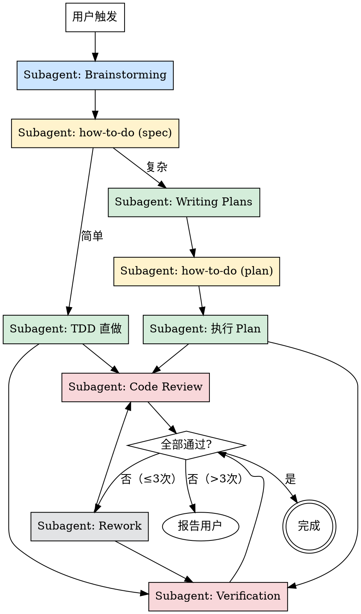

# FullWorkFlow — 全流程编排

一键完成：brainstorming → 复杂度分析 → 实现 → 验证。全程使用 subagent，主会话仅做编排。

**开始时宣布：** "使用 full-workflow 技能，启动全流程开发。"

## 核心原则

- **全部 subagent** — 每个阶段派 subagent 执行，主会话只做编排和决策路由
- **最小上下文** — subagent 只接收当前阶段的必要信息，不传递历史
- **并行优先** — 无依赖的阶段并行执行
- **60% 红线** — 单个 subagent 预估上下文用量超过可用上下文的 60% → 必须拆分

## 完整流程



## 阶段 1: Brainstorming

**目标：** 通过协作对话生成设计 spec

**操作：**
1. 读取 prompt 模板：`brainstorming-prompt.md`
2. 用 `general-purpose` subagent 派发，传入：
   - 用户原始需求
   - 项目根目录路径
   - brainstorming skill 路径：`referenced-skills/brainstorming/SKILL.md`
3. subagent 通过 AskUserQuestion 与用户交互
4. subagent 输出格式：
   ```
   {
     "spec_path": "docs/superpowers/specs/YYYY-MM-DD-<topic>-design.md",
     "summary": "一句话概述设计内容"
   }
   ```

**注意：** brainstorming subagent 拥有完整交互权，用户与它直接对话。主会话等待它返回结果。

## 阶段 2: how-to-do（复杂度判断）

**目标：** 分析 spec，预估上下文消耗，选择执行策略

**操作：**
1. 读取 prompt 模板：`how-to-do-prompt.md`
2. 用 `general-purpose` subagent 派发，传入：
   - spec 文件路径
   - 分析阶段标记：`spec`（初次判断）
3. subagent 输出格式：
   ```
   {
     "complexity": "simple" | "complex",
     "next_skill": "tdd" | "writing-plans",
     "reason": "判断依据的一句话说明"
   }
   ```

### 60% 红线规则

subagent 在判断时必须遵循：
- 估算实现所需上下文（需读取的代码 + 需写入的代码 + 推理开销）
- **< 40% 可用上下文** → 简单，TDD 直做
- **40%-60%** → 边界情况，保守起见选 writing-plans
- **> 60%** → 必须拆分，选 writing-plans

## 阶段 3: 实现

### 路径 A：简单 → TDD 直做

1. 派 `general-purpose` subagent，传入：
   - spec 路径
   - 指令：遵循 TDD skill（`referenced-skills/test-driven-development/SKILL.md`）实现 spec 中描述的所有功能
   - 约束：不要超过上下文预算，遇到复杂度超预期立即报告
2. subagent 输出：
   ```
   {
     "status": "done" | "blocked",
     "files_changed": ["path1", "path2", ...],
     "blocker_reason": "..." // 仅 blocked 时
   }
   ```

### 路径 B：复杂 → Writing Plans → 执行

**步骤 B1：Writing Plans**

1. 派 `general-purpose` subagent，传入：
   - spec 路径
   - 指令：遵循 writing-plans skill（`referenced-skills/writing-plans/SKILL.md`）
   - 约束：每个 task 的预估上下文消耗不得超过 60% 红线，超过的 task 必须继续拆分
2. subagent 输出：
   ```
   {
     "plan_path": "docs/superpowers/plans/YYYY-MM-DD-<feature-name>.md"
   }
   ```

**步骤 B2：how-to-do（执行策略）**

1. 再次派 how-to-do subagent，传入：
   - plan 路径
   - 分析阶段标记：`plan`（二次判断）
2. subagent 输出：
   ```
   {
     "execution_skill": "tdd" | "executing-plans" | "subagent-driven" | "parallel",
     "reason": "..."
   }
   ```

**步骤 B3：执行**

根据 execution_skill 选择策略：

| execution_skill | 实现方式 | skill 引用 |
|----------------|---------|-----------|
| `tdd` | 单 subagent TDD 实现 | `referenced-skills/test-driven-development/SKILL.md` |
| `executing-plans` | 单 subagent 串行执行 | `referenced-skills/executing-plans/SKILL.md` |
| `subagent-driven` | 多 subagent 逐 task 执行 + review | `referenced-skills/subagent-driven-development/SKILL.md` |
| `parallel` | 并行 subagent + 汇总 | `referenced-skills/dispatching-parallel-agents/SKILL.md` |

派 subagent 时传入 plan 路径和对应 skill 路径。subagent 输出：
```
{
  "status": "done" | "blocked",
  "files_changed": ["path1", ...],
  "blocker_reason": "..."
}
```

## 阶段 4: 验证

Code Review 和 Verification **并行执行**。

### Code Review subagent

派 `general-purpose` subagent，传入：
- 变更文件列表
- spec/plan 路径（作为评审依据）
- 指令：遵循 requesting-code-review skill（`referenced-skills/requesting-code-review/SKILL.md`）进行代码评审

输出：
```
{
  "passed": true | false,
  "issues": [
    { "severity": "critical" | "important" | "minor", "description": "...", "file": "...", "suggestion": "..." }
  ]
}
```

### Verification subagent

派 `general-purpose` subagent，传入：
- 变更文件列表
- 项目测试命令
- 指令：遵循 verification-before-completion skill（`referenced-skills/verification-before-completion/SKILL.md`）

输出：
```
{
  "passed": true | false,
  "issues": [
    { "severity": "critical" | "important" | "minor", "description": "..." }
  ]
}
```

## 阶段 5: Rework 循环

汇总两个 subagent 的结果：

**全部通过** → 完成，向用户报告最终结果

**有 Critical 或 Important issues** → Rework：
1. 读取 prompt 模板：`rework-prompt.md`
2. 派 rework subagent，传入所有 issues 和变更文件列表
3. rework 完成后重新并行执行 Code Review + Verification
4. **最多循环 3 次**
5. 超过 3 次仍失败 → 向用户报告所有 issues，等待用户指示

**只有 Minor issues** → 记录但不阻塞，通知用户

## Subagent 派发规范

**每次派 subagent 时：**
1. 明确指定 subagent 类型（通常 `general-purpose`）
2. prompt 中包含：
   - 任务目标（一句话）
   - 输入信息（文件路径、具体数据）
   - 引用的 skill 文件路径（让 subagent 自己去读）
   - 输出格式要求
   - 约束条件
3. 不传递会话历史，subagent 从零开始
4. subagent 可以使用 AskUserQuestion 与用户交互（brainstorming 阶段）

**主会话只做：**
- 解析 subagent 返回的 JSON
- 基于返回值做路由决策
- 组装下一个 subagent 的 prompt
- 向用户报告关键节点状态

## 完成

流程结束后向用户报告：
- spec 文件路径
- plan 文件路径（如有）
- 变更文件列表
- 验证结果摘要
- 遗留的 Minor issues（如有）

然后使用 `finishing-a-development-branch` skill 完成分支收尾。
